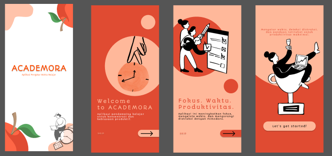
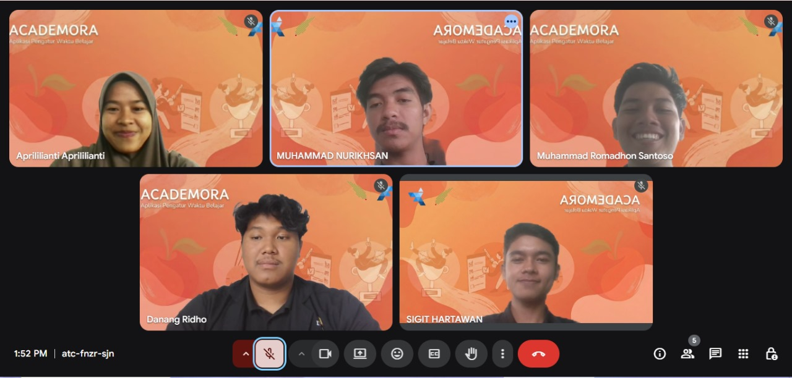

# Tugas Besar Desain Interaksi

**Judul Proyek:** Academora - Aplikasi Pengatur Waktu Belajar (Pomodoro)  
**Kelompok:** 4  

## 👥 Anggota Kelompok
| No | Nama | NIM |
| :--- | :--- | :--- |
| 1 | **Danang Ridho Laksono** | 123140005 |
| 2 | **Muhammad Romadhon Santoso** | 123140031 |
| 3 | **Sigit Kurnia Hartawan** | 123140033 |
| 4 | **Aprililianti** | 123140041 |
| 5 | **Muhammad Nurikhsan** | 123140057 |

**Dosen Pengampu:** Amirul Iqbal, S.Kom., M.Eng.  
**Asisten:** Muhammad Fauzi Azizi

---

## 🔗 Tautan Proyek (Project Links)

* **Desain & Prototype (Figma):** [Klik disini untuk melihat Figma](https://www.figma.com/proto/SKF1KhlQOOvrAKbcfqAe8P/Interaksi-Desain-Kel-4-RB?node-id=378-90&p=f&t=mcQrOWNkhKiArsCO-0&scaling=scale-down&content-scaling=fixed&page-id=0%3A1&starting-point-node-id=378%3A80)
* **Dokumen Proposal (Google Docs):** [Klik disini untuk melihat Proposal](https://docs.google.com/document/d/1lOT-UJVU59mzmzdC4x3UvTRJYZSzExMVFPvG-DAc_oM/edit?usp=sharing)

* **Dokumen Laporan Akhir (Google Docs):** [Klik disini untuk melihat Laporan](https://docs.google.com/document/d/1FEk3rj8l8eNOev-Mv5IWYgtIGjX04BTB2MRBh33JmKo/edit?usp=sharing)

* **Dokumen Asistensi 1 (Google Docs):** [Klik disini untuk melihat ](https://docs.google.com/document/d/1VogYesY2Duw4tB-fOggwFzf58lZsRKJduwAIrYN7M4U/edit?tab=t.0#heading=h.osbottwh8xp)

* **Dokumen Asistensi 2  (Google Docs):** [Klik disini untuk melihat ](https://docs.google.com/document/d/1H7SqObf__ZzwH8W-I12T9i94lonFnIGF7eR2CbKm3x8/edit?tab=t.0#heading=h.osbottwh8xp)

* **Dokumen Asistensi 3 (Google Docs):** [Klik disini untuk melihat ](https://docs.google.com/document/d/1KqNHN8vIxs48vbX38oiq_1WQ6gdMKzl_QqBwPWQkA68/edit?tab=t.0#heading=h.osbottwh8xp)

* **Link Prototype (Figma):** [Klik disini untuk melihat Figma](https://www.figma.com/proto/SKF1KhlQOOvrAKbcfqAe8P/Interaksi-Desain-Kel-4-RB?node-id=0-1&p=f&t=yOkkgW12GPoQpimH-0&scaling=scale-down&content-scaling=fixed&page-id=0%3A1&starting-point-node-id=378%3A80)
## 🍎 Tentang Academora

**Academora** adalah aplikasi manajemen waktu belajar yang dirancang dengan pendekatan *User-Centered Design*. Aplikasi ini mengimplementasikan metode **Pomodoro** untuk membantu mahasiswa meningkatkan fokus dan produktivitas, sekaligus menjaga keseimbangan kesehatan mental dengan jadwal istirahat yang teratur.

Proyek ini merupakan hasil transformasi desain dari tahap *Low-Fidelity* menjadi *High-Fidelity*.

### Fitur Utama:
* **Smart Pomodoro Timer:** Pengaturan waktu fokus (25 menit) dan istirahat (5 menit) yang intuitif.
* **Focus-Friendly UI:** Menggunakan palet warna "Organic Warmth" (Red Tomato & Sage Green) untuk mengurangi kelelahan mata.
* **Task Management:** Pengelolaan daftar tugas harian yang sederhana agar pengguna tetap terorganisir.

---

## 🔄 User Flow (Alur Pengguna)
   

---

## 🎨 Design System

Desain ini dibangun dengan filosofi kenyamanan dan fokus:

* **Primary Color:**   
  *Melambangkan energi fokus.*
  
* **Secondary Color:**   
  *Melambangkan kesegaran dan istirahat.*
  
* **Background:**  /   
  *Memberikan kesan "Safe Space" untuk belajar.*
  
---

## 📱 Pratinjau (Preview)

## 📱 Tim Desain 
